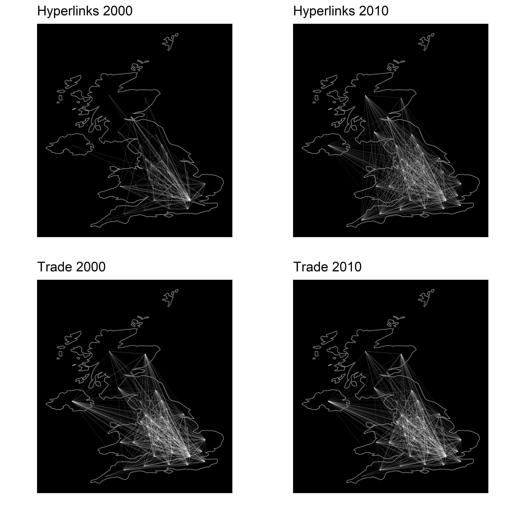
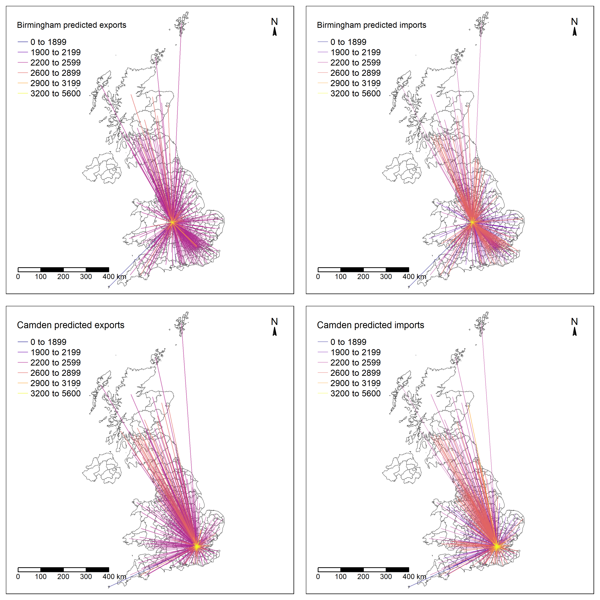

<!-- to add an appendix add "appendix: appendix.tex" in the YAML before abstract  -->
<!-- and amend the appendix.tex -->

```{r setup, include=FALSE}
knitr::opts_chunk$set(echo = FALSE, message = FALSE) # By default, hide code; set to TRUE to see code
knitr::opts_chunk$set(fig.pos = 'p') # Places figures on their own pages
knitr::opts_chunk$set(out.width = '100%', dpi=300) # Figure resolution and size
knitr::opts_chunk$set(fig.env="figure") # Latex figure environment

#insert libraries here
library(rprojroot)
library(tidyverse)
library(knitr)
library(randomForest)
library(readxl)
library(httr)
library(rgdal)
library(geosphere)
library(raster)
library(corrplot)
library(gridExtra)
library(ggrepel)
library(caret)
library(DataExplorer)
library(skimr)
library(rprojroot)
library(kableExtra)
library(DescTools)
library(doParallel)
library(patchwork)
library(stargazer)
library(directlabels)
library(png) 

# This is the project path
path <- find_rstudio_root_file()
```

# Introduction {#sec:1}

<!-- Importance of regional trade -->
Bilateral trade is a complex phenomenon per se [@topology_trade], but its complexity 
increases when it is approached from a spatially disaggregated perspective. 
Regions^[In the paper we shall use the terms 'regional' and 'subnational' interchangeably.]
behave differently from countries from an economic perspective as they are 
more specialised in specific sectors and more open to trade with other regions in 
comparison to national economies [@isard1951interregional; @miller2009input]. 
Therefore, they face intense external dependencies [@matter2009economic].
Also, regions vary greatly in terms of their specialisation patterns and, therefore, 
there is great variation in terms of trade relationships and openness within regions 
[@fingleton2012recessionary]. 
Furthermore, because of globalisation patterns and the spatial fragmentation of 
production, regional trade of intermediate and final products is no longer constrained 
to interregional transactions within countries. So, by lowering trade 
barriers in the past decades, restrictions to international trade declined and the 
external dependence of regions became global. Events happening in regions of countries 
from the other side of the globe can affect closer regions through disruptions in 
Global Supply Chains, as the Covid-19 crisis is showing us [@guan2020global; @david2013china]. 
A region would be affected by an economic downturn in a second region if it sells 
much of its production to 
that region (directly), or if it sells its production to regions that sell their 
production to that region (indirectly), while regions less dependent on that second 
region might be hurt to a much lesser extent when in crisis [@thissen2016competitive]. 
This is why, among other factors, regions had significantly divergent experiences 
in avoiding or overcoming economic shocks [@kitsos2019role]. 

Consequently, understanding and, if possible, predicting regional trade is key to 
comprehend regional economic performance and the exposure to internal and external 
shocks, but also to articulate proper place-based development policies [@barca2009agenda]. 
Interregional relations and modern supply chains are central in a systemic way of 
thinking about regional innovation and growth strategies [@thissen2013integrated] 
such as the smart specialisation policy initiatives [@mccann2015smart].
Equally, not having a clear picture of regional trade dependencies may impede our 
capacity to design effective regional economic policies. Our paper provides tools
to map such regional trade dependencies.

<!-- lack of data -->
The big caveat is the lack of sectoral, interregional trade data, which are absent 
from key cross-country data providers such as the Eurostat and OECD. One exception 
is the work of @thissen2013integrated, who followed the parameter-free @simini2012universal 
approach and estimated interregional trade flows between 256 European NUTS2 regions
at a sector level by disaggregating national input-output tables.
These data have been utilised in regional economics research -- see discussion and 
references in Section [4](#sec:4) -- and are nowadays the go-to interregional trade 
data set. Nevertheless, production of such data are neither simple nor easily reproduced.
Normally, these type of data are only available at the national level and 
released infrequently (usually every 5 years) by statistical institutes, because 
they are based in expensive and time-consuming industrial surveys [@boero2018regional]. 
This illustrates the difficulty of building a database about interregional trade.

<!-- contribution -->
Our paper contributes to this line of inquiry by utilising novel web data and 
machine learning algorithms to make temporal out-of-sample predictions for the 
UK NUTS2 regions during the period $2000$-$2010$. Specifically, we use open and 
archived web data to create counts of hyperlinks between commercial websites that we are able
to geolocate. We feed such variables to a Random Forest (RF) model, alongside a limited 
number of other predictors, and we are able to achieve accuracy scores above 90% 
in predicting *unseen* interregional trade flows. Our underpinning hypothesis is 
that physical trade leaves behind digital breadcrumbs [@rabari_storper2014], which can be 
effectively utilised to capture interregional trade flows, which are both important 
for regional policies and also very difficult to observe.

Our proposed research framework not only allows for accurate prediction of interregional 
trade flows, but also for disaggregating such flows at more granular spatial units
representing local authorities. Hence, it has the potential to directly support 
local authorities in the efforts to identify external dependencies and vulnerabilities
to supply chain disruptions. Importantly, such accurately predicted interregional 
and granular trade flows can assist ex ante evaluations of place-based economic policies.

<!-- geography and SIM -->
Modelling interregional trade flows has traditionally been within the core of geographical
research as it well embedded within the discipline's effort to explain the determinants
of aggregated interactions across space [for a recent review see @oshan2020spatial].
Methodological and conceptual developments on *spatial interaction models* have been
extensively employed in order to model flows of trade between regions 
[@chun2012modeling; @paul2008incorporating] and countries [@de2017testing;
@de2017competing]. Following current debates within the quantitative geographical 
thinking [@singleton2021geographic] and, more broadly, computational social sciences
[@lazer2009social], geographical research has been focusing more on explaining the
determinants of interregional trade flows than predicting such flows. 

<!-- ML, prediction, econonimcs geog -->
This paper is aligned with current epistimological debates in geography [@singleton2021geographic; 
@creditspatial] and economics [@kleinberg2015prediction] regarding the role of machine
learning algorithms in making out-of-sample predictions of data instead of focusing
on explanatory research frameworks. Simply put, the above advocate towards 
the use of ML algorithms, such as RF, as they outperform ordinary least squares
-- still one of the widely used estimators to model interregional trade flows --
in out-of-sample predictions even when using moderate size training datasets and 
limited number of predictors [@mullainathan2017machine; @athey2019machine]. Such
an approach can be particularly useful for predicting interregional trade flows given
the scarcity and cost to produce such data.

The structure of the paper goes as following. The next section reviews the literature
which either highlighted the lack of interregional trade data or employed innovative
and often data-intensive approaches to capture such flows. Then, we describe the 
methods and the data we use and present the results of the analysis as well as sensitivity
checks. We also present an illustrative example of how our models can be used to 
map trade flows at an even more spatially disaggregated level. The paper ends with 
a conclusions section.

# From the lack of regional trade data to the use of webdata {#sec:2}

This section reviews different literatures, which either aim to model trade flows 
or employed some form of web data to capture spatial relationships given the lack 
of relevant data. Not having directly available data to map interregional trade 
hinders policy makers from understanding in detail the economic dependencies of 
regions and, therefore, design appropriate regional economic policies. 

The lack of bilateral trade data resulted in a very prolific branch of the literature 
attempting to estimate trade flows at country and regional level. Without a doubt, 
the most important step in this regard was the introduction of gravity equations 
in the early works of @tinbergen1962shaping, @linnemann1966econometric and @leamer1r. 
In summary, a gravity equation is based on the idea that bilateral trade between 
two territories depends on their sizes (expressed normally as GDP or GDP per capita) 
in relation to the distance between them or transport costs (as an impediment factor), 
and some preference factors (common border, common language, etc.) [@egger2002econometric; 
@anderson2003gravity]. In the last years, the emphasis has been placed on discussing 
the proper estimation methods to accurately predict trade flows (OLS, Tobit, panel 
fixed effects, Heckman two-step, etc.). A review of the alternative methods applied 
in gravity models can be seen in @gomez2013comparing. 

A different strand of the literature comes from the multisectoral trade analysis 
of Input-Output flows. While the theoretical framework of multiregional Input-Output 
databases was developed in the 1950s [@isard1956location], the biggest empirical 
take-off did not come until the release of the World Trade Organisation databases 
such as the WIOD (World Input-Output Database) [@dietzenbacher2013construction]. 
The availability of a series of homogeneous tables describing sectoral trade flows 
within and between countries was a significant factor behind the revitalisation 
of the global value chains and defragmentation studies [@timmer2015illustrated; 
@los2015global; @los2016tracing; @antras2018measurement], as well as for the analysis 
of the global environmental footprints [@arto2014comparing; @owen2016explaining].

Still, those global databases based on official national accounting data 
that is business surveys
are only available at the country level, and researchers and statistical offices that 
want to use a multi-regional Input-Output model at a subnational level need to 
estimate such interregional flows between sectors and regions within 
a country. Several non-survey methods were developed with that aim, among them the 
ones based on Location Quotients, the cross-hauling adjusted regionalisation method 
(CHARM), and entropy methods. They all rely on structural macroeconomics identities 
in order to be consistent with the total volumes coming from the known regional 
figures and with the sector-by-sector framework. Examples of this are the works 
by @sargento2012inter, @tobben2015construction or @boero2018regional, among many 
others.

More related to the focus of this paper, @hellmanzik2016gravity 
and @hellmanzik2017taking explored the role of 'virtual' proximity in explaining 
the trade in services between countries and their international financial integration. 
Both papers used data from @chung2011geography, who utilised the universe of 
the Yahoo indexed websites from 2003 and 2009: 33.8 billion websites from 273 different 
country top-level domains (ccTLD). They mined these data and identified 9.3 billion
hyperlinks between these websites. The aggregation of these bilateral hyperlinks 
at country level was termed as virtual proximity. Following @kimura2006gravity, 
@hellmanzik2016gravity and @hellmanzik2017taking estimated 
gravity models to test whether international trade is associated with the volume of 
hyperlinks between countries. Their results indicated that indeed, the aggregated 
volume of hyperlinks between countries is 
a significant determinant of services trade and its effect is particularly large 
for finance services, but also for communications, insurance, IT and 
audio-visual services. Government and construction trade services, on the other 
hand, appear to be less associated with virtual proximity. In any case, their findings 
illustrate how virtual proximity may reduce the negative effects of distance, providing 
a possible explanation for the decline in the distance effect on international services 
trade found by @head2009remote.

<!-- Toponym co-occurrence -->
More broadly, web data have been utilised in order to study spatial relationships. 
Recently, @meijers2019using proposed the 'toponym co-occurrence approach' to study 
intercity relationships. Their study is based on retrieving relevant information 
from text corpora by considering when places (i.e. toponyms) are mentioned together 
in the same website. Then, they employ machine learning techniques to understand 
the context within which these place toponyms co-occurred and cluster these relationships.
Their results reflect the spatial interdependencies within the Dutch settlement 
system and illustrate the utility of web data to capture such spatial relationships 
and complement existing relational data sources or substitute the lack of such data.
In a similar manner, @devriendt2008cyberplace and @janc2015visibility employed 
the Google search engine to create counts of webpages which mentioned pairs of cities 
in order to build urban connectivity measures.

<!-- Wikipedia -->
Other researchers focused on more handpicked subsets of the web.
@kessler2017extracting and @salvini2016spatialization employed Wikipedia
to study spatial relationships. While the former used the hyperlinks 
between German Wikipedia webpages to represent the hierarchy of urban centres in 
Germany, the latter utilised the English Wikipedia to build a graph of world cities.
<!-- Blogs -->
@lin2007blog used hyperlinks from US-based webblogs to analyse the spatial reflections 
of the blogsphere. In the same vein, @jones2010blog used hyperlinks between webblogs 
focused on the New York City theater scene to investigate the existence and role 
of a 'virtual buzz'.
<!-- Admin websites -->
A number of studies utilised hyperlinks between and to administrative websites to 
study spatial relationships and structure [@holmberg2009local; @holmberg2010co; 
@janc2015geography].

<!-- Universities -->
Studying university websites and their hyperlinks is a popular application of *webometrics*,
or, in other words, "the quantitative study of [w]eb-related phenomena" @thelwall_webometrics.
Early work from Thelwall [@thelwall2002top; @thelwall2002evidence] analysed the 
distribution of hyperlinks between university websites and the role geography plays 
in how universities establish hyperlinks. Ortega and Aguillo 
[-@ortega2008linking; -@ortega2008visualization; -@ortega2009mapping] broaden the 
scale of analysis focusing on universities from Europe and around the world.
More recently, @hale2014mapping using the same data employed for this paper analysed 
the graph of hyperlinks between UK university websites. Reflecting earlier results, 
their analysis highlighted the role of distance in establishing hyperlinks contrary 
to league table rankings, which do not seem to drive such linkages.

<!-- Early work on hyperlinks -->
The association of physical distance with the distribution of hyperlinks was the
focus of the earliest, to our knowledge, application of webometrics on studying 
spatial relationships. Using a limited sample of websites, @halavais2000national 
indicated that hyperlinks tend to follow national borders and gravitate towards 
the US.

<!-- Business -->
The use of web data has also been employed to answer business related research questions.
@vaughan2006hyperlinks studied hyperlinks to business websites and found that 
such links reflect business motivations and contain useful business information.
Nevertheless, they observed scarcity of links to competitors.
Other studies found significant correlations between the number of incoming links 
and business performance [@vaughan2004exploring; @vaughan2004links]. 
More recently, @kruger2020digital used hyperlinks between business websites in Germany 
to test the role of different proximity frameworks, which were operationalised using 
hyperlinks data, on the innovative behaviour of these firms. Their results indicated 
that innovative businesses share more hyperlinks with other business, which also 
tend to be innovative. Moreover, innovative businesses are being located in dense 
urban areas and share hyperlinks with websites from remote businesses.

In summary, the scarce of bilateral regional trade data is a well-established problem
in the relevant literature. Research has done some first steps towards employing 
the wealth of web data in order to capture country-to-country trade relationships.
Such approaches capitalised the tradition of webometrics research, which has also 
been focusing on illustrating spatial relationships. Building upon such studies,
this paper aims to address the lack of regional trade data problem by employing 
open and underutilised data from web archives. Importantly, we do this within a 
state-of-the-art ML framework, which is described in the next section.

# Methodological framework {#sec:3}

Random Forest (RF) is the main estimator we employ in order to predict inter-regional trade flows.
This is a widely used ML technique both for regression and classification problems 
[@biau2012analysis]. It was firstly introduced by @breiman2001random and since then 
its popularity increases making it a standard tool for data science problems. The 
benefits of RF include its capacity to handle skewed distributions and outliers 
and to effectively model non-linear relationships between the dependent and independent 
variables, the small number of hyperparameters that need to be tuned, the low sensitivity 
towards the values of these parameters as well as the relatively short training time 
[@Caruana2008; @liaw2002classification; @yan2020using].
Moreover, predictions based on RF are more accurate than those based on  single 
regression trees, can illustrate the predictor importance, are fast and easy to 
implement [@breiman2001random; @sulaiman2011intelligent; @pourebrahim2019trip; @biau2012analysis].
Current economic thinking advocates towards the use of RF as they tend to outperform 
ordinary least squares in out-of-sample predictions even when using moderate size 
training datasets and limited number of predictors [@mullainathan2017machine; @athey2019machine].
All the above advocate towards utilising RF in this paper as we aim to do temporal out-of-sample 
predictions of data, which are skewed and have outliers (see for instance Figure 
\ref{prediction}).

<!-- random forests examples/review -->
RF have been extensively utilised in answering regression research problems.
<!-- @cheng2019applying used RF to model and predict travel mode choices based on travel diary data from Nanjing, China. -->
@pourebrahim2019trip coupled a traditional methodological framework -- gravity and 
spatial interaction modelling -- with ML techniques including RF as well as data 
from online social media to predict commuting flows in New York City.
@lima2020predicting used ML and RF to predict and explain corruption across countries.
<!-- @robinson2018machine used XGBoost and Artificial Neural Network models to predict global migration. -->
<!-- @scheuer2018combining RF for classification problem regarding residential housing choices -->
<!-- @tribby2017analyzing used RF to select variables associated with walking route choice models -->
@sinha2019assessing open a dialogue on the need for spatial ensemble learning approaches, 
such as RF, aimed to be used with spatial data with high autocorrelation and heterogeneity.
@creditspatial introduced spatially explicit RF to predict employment density in 
Los Angeles.
<!-- @stevens2015disaggregating use RF to generate a gridded prediction of population density at fine-grained spatial resolution. -->
@guns2014recommending use RF to predict and recommend high-potential research collaborations, which have not yet been materialised.
@ren2019predicting trained RF as well as other classifiers to predict socio-economic 
status or cities using a variety of online and mobility predictors.
@wang2017structure employed RF and other machine learning algorithms to predict 
urban socio-economic characteristic based on non-emergency urban requests or complaints 
reported to the 311 phone number. RF tend to perform better than other algorithms 
in predicting, for example, real estate prices, income per capita, percentage of 
residents with a graduate degree, percentage of unemployed residents, percentage 
of residents living below the poverty level, as well as demographic characteristics 
for 30 US cities.

RF is a tree-based ensemble learning algorithm [@breiman2001random]. It starts by creating 
random samples of the training data, which are then used to grow an equivalent number 
of regression trees to predict the dependent variable. This variable can be either 
a continuous one for regression problems or a categorical one for classification problems.
Both observations and predictors are randomly sampled for the individual trees.
Importantly, no pruning is applied for the trees to fully grow. Instead, these decision 
trees are trained in parallel on their own sample of the training data created with bootstrapping.
An essential attribute of RF is their capacity *not* to overfit. The latter refers 
to the capacity of a model to explain very well a specific dataset, but not being 
able to generalise the learned patterns to an unseen test dataset. Even though each 
tree on its own can overfit, the forest -- i.e. the ensemble of trees -- does not 
suffer from overfitting because the individual tree errors are averaged to produce 
the error of the overall forest leading also to decreased variance between trees 
[@last2002improving].
To make a prediction for regression problems, RF average the predictions of all 
decision trees. So, the trade flows $IO$ between regions $i$ and $j$ can be represented as:

\begin{align}
f(X_{i}, X_{j}, Z_{ij}|\hat{\theta}|) = \frac{1}{B} \sum_{b = 1}^{B} \hat{T_{b}} \label{eq:trees}
\end{align}

where, $X_{i}$, $X_{j}$, and $Z_{ij}$ are the origin $i$, destination $j$ and origin-destination 
pair $ij$ predictors of regional trade respectively, $\hat{\theta}$ is a vector 
of the estimated hyperparameters, $B$ is the total number of trees the RF grew, 
which is also one of the estimated hyperparameters and $\hat{T_{b}}$ represents 
the prediction of each independent tree [@yan2020using].

To estimate RF models we employ the widely used `caret` package for `R` [@kuhn2008building]
and we build the following *rolling forecasting* workflow:
*(1)* train RF models on data from years $t$ and $t + 1$ from the study period 2000-2010
to increase the size of the training dataset;
*(2)* evaluate their predictive capability using cross validation (CV);
*(3)* apply the estimated RF models from step *(1)* on unseen data from the following 
year $(t + 2)$ to predict trade flows for that year and evaluate their 
predictive capability of such unseen data.
<!-- and *(5)* the comparison of the predictive capability of RF against other widely 
used methods including Ordinary Least Squares (OLS) and "extreme" gradient boosting 
regression (XGBoost - @chen2016xgboost). -->

We opted against pooling the data to maintain their temporal structure both for 
methodological and conceptual reasons. Random sampling and pooling may lead to utilise 
future values of hyperlink flows to predict past regional trade flows, which might 
be counterintuitive. Instead, we opted towards building biyearly RF models with 10-fold 
CV to assess their in-sample predictive capability. To do so, we split the biyearly subsets 
of the data in 10 random samples, trained a RF on the nine and tested its predictive 
capacity on the holdout one. This process is repeated ten times in order for all 
10 samples to act as holdout ones. Then, the predictive performance of the RF is 
equal to the mean performance of the 10 models.
This workflow enables us to make temporal out-of-sample predictions and test our models and 
research framework in previously unseen data. Importantly, it helps avoid overfitting, 
which would have occurred if the temporal structure of the data and the underpinning 
time-dependent data generation processes had been ignored. Such discussions can be found
in the spatial interaction modelling literature [@mikkonen1999parameters; @mozolin2000trip;
@oshan2020potential]. Successful predictions within this framework can illustrate 
the digital traces that regional trade leaves behind and how useful such web data 
are in predicting trade flow that we have little information about.

To assess the predictive capability of the models, we utilise three broadly used 
metrics: the coefficient of determination (R squared), mean absolute error (MAE) 
and root mean square error (RMSE):

\begin{align}
R^2 = 1 - \frac{\sum_{k} (y_{k} - \hat{y_{k}})^2} {\sum_{k} (y_{k} - \overline{y_{k}})^2} \label{eq:rsquared}
\end{align}

\begin{align}
MAE = \frac{1}{N} \sum_{k = 1}^{N} |\hat{y_{k}} - y_{k}| \label{eq:mae}
\end{align}

\begin{align}
RMSE =  \sqrt{\frac{\sum_{k = 1}^{N} (\hat{y_{k}} - y_{k})^2} {N}} \label{eq:rmse}
\end{align}
$y_{k}$ is the $k^{th}$ observation of the dataset, which consists of $N$ observations 
in total. $\hat{y_{k}}$ is the $k_{th}$ predicted value for the dependent variable 
and $\overline{y_{k}}$ is the average value of $y$. The last two metrics are expressed 
in the same units as the dependent variable -- $\pounds 100,000s$ -- while the first 
one is the coefficient of determination between the observed and the predicted values 
of regional trade flows. Regarding $MAE$, it is the absolute difference between 
the observed and the predicted trade flows. While $MAE$ does not penalise for large 
errors, $RSME$ does so as it is proportional to the squared difference between the 
observed and the predicted trade flows. This means that larger errors carry more 
weight for $RMSE$ [@pontius2008components].

RF allow to estimate the predictor importance. Using the built-in bootstrapping 
procedure, MSE is recorded for each tree when including all the predictors and then 
again by excluding one by one all the predictors. The derived decrease in the MSE 
created by removing each predictor signifies its importance in the model 
[@breiman2001random]^[See also the `randomForest` `R` package, which is based on 
Breiman's [-@breiman2001random] original implementation].

We then move to test the predictive capacity of RF trained on years $t$ and $t + 1$ 
on unseen data from the year $t + 2$. This yearly data split equites to a *firewall principle* 
[@mullainathan2017machine], which prevent data leakage between the training and 
the test dataset. Being able to accurately predict unseen regional trade flows provides 
further statistical evidence for the validity of our proposed research strategy.
Moreover, it advocates towards the utility of our research strategy and its applicability 
in predicting regional trade flows. 

Our research framework enables us to disaggregate the models and predictions 
in terms of both economic sectors and spatial units
and, therefore, we are able to further assess their sensitivity. In addition, we 
utilise different subsets of the web data as another robustness checks. The details
of these data are exaplained in the next section.

<!-- Nevertheless, the above approach may suffer from a small training dataset size as  -->
<!-- the training and the test dataset have almost the same size. -->
<!-- To overcome this issue we present another set of results, for which we train our models on years $t$ and $t + 1$ to double the training dataset size and predict the trade flows for the years $t + 2$. -->

<!-- Finally, our research strategy involves the comparison of our prediction results with other models. -->
<!-- On top of a standard gravity model with and without the main variable of interest -- hyperlinks -- we also estimate XGBoost models. -->
<!-- Just like RF, this is another widely used ML tool, which is based on gradient boosting trees and performs well on both regression and classification problems [@mason2000boosting]. -->

# Data {#sec:4}

<!-- Web data -->
The hyperlinks data have been derived from the JISC UK Web Domain Dataset [@ukwebarchive]^[[https://data.webarchive.org.uk/opendata/ukwa.ds.2/](https://data.webarchive.org.uk/opendata/ukwa.ds.2/)]. 
The latter contains all the webpages under the .uk country code top level 
domain (ccTLD), which have been discovered and archived by the Internet 
Archive (IA)^[[https://archive.org/](https://archive.org/)] during the 1996-2010 period. 
Regarding the extent of the IA, this is not trivial to assess given that the actual 
size of the web is unknown. Studies from the digital humanities field claim that 
although it is difficult to evaluate the coverage of web archives, the IA is the 
most extensive and complete archive [@Ainsworth2011; @Holzmann2016].
Using a different subset of the IA, @thelwall2004fair suggested that $92$% of all 
US based commercial websites had been archived. 

This openly accessible dataset contains c. $2.5$ billion URLs, which point to archived 
.uk webpages, the HTML content of which can be obtained through the IA API, as well 
as the archival timestamp. We utilise two subsets of these data: the so-called 
Geoindex and the Host Link Graph. The first includes all the archived .uk webpages 
the web text of which contains at least one string in the form of a UK postcode, 
e.g. "B1 1AA", and we use this information to geolocated these wepbages and the 
websites these webpages are contained within. The Geoindex dataset contains almost 
$700$ million URLs which point to such webpages, the postcodes and the archival 
timestamp [@BL2013geo].
<!-- geolocation -->
It should be highlighted that such a geolocation procedure using the HTML text and 
references to postcodes does not entail the same limitations with IP geolocation
attempts [@zook2000web] and the 'here and now' issues linked to user generated data
from social media [@geotag]. 
These data have been employed before in answering social science research questions.
@Musso2016 reconstructed the UK business web ecosystem during the 1996-2001 period 
and @tranos2020digital illustrated the long term regional productivity effects 
of the early adoption of web technologies. @tranos2020individual explored the role 
of online content of local interest in attracting individuals online and @Hale2014
mapped the web presence of the UK universities.
However, to our knowledge this is the first time that such extended, but also granular
in terms of space and time, archived web data has been utilised to model interregional 
flows and, more specifically, trade.

The Host Link Graph dataset was constructed by scanning the overall dataset for 
hyperlinks between websites [@BL2013links]. In essence, this is a long edge list 
and each observation contains the website where the hyperlinks originate from, the 
website the hyperlinks point to, the number of hyperlinks between this origin-destination 
pair of websites and the archival timestamp.
Between 2000 and 2010, $1.6$ billions hyperlinks were found, with the majority being 
links between different webpages within the same website.

To create interregional flows of hyperlinks, we then combine the above datasets 
using the following workflow. 
<!-- aggregation -->
Firstly, we aggregate the Geoindex data from webpages to websites by grouping together all
archived webpages which are contained under the same website^[For example the following webpages 
http://www.examplewebsite.co.uk/webpage1 and http://www.examplewebsite.co.uk/webpage2 
are part of the http://www.examplewebsite.co.uk/ website.].
<!-- .co.uk -->
Because our aim is to predict interregional trade we only include in our analysis 
commercial websites by filtering out websites which are not part of the .co.uk second 
level domain (SLD) [@THELWALL2000441]. UK based companies are free to adopt a generic
TLD such as .com and such websites are not included in our data. Nevertheless, we do 
not expect any substantial bias because of such omissions given the popularity 
of the .uk TLD. For instance, UK customers have a strong preference towards .uk
websites for purchasing products and services [@hope]. Moreover, .co.uk is by 
far the most popular SLD under the .uk ccTLD [@tranos2020digital]. 
Regarding the geolocation of such commercial websites, given that their mission is
to support businesses [@blazquez2018big], we expect that the self-reported 
physical addresses in the form of postcodes refer to trading instead of registration 
address. 
After all, "the firm must include on its website all the information it wants its 
real and potential clients to know, presenting it in the most adequate manner" [@Hernandez, p. 364].

<!-- n. of postcodes -->
During this aggregation process we keep track of how many unique postcodes are included 
in every website per year. Table \ref{sld.f} presents the frequencies of websites 
based on counts of unique postcodes per website for $2000$. We create two 
subsets to test our models. We first train and test our models on data including 
only websites (and their hyperlinks), which contain only one unique postcode.
Such websites may represent a small company with a single trading location and, therefore,
the website geolocation procedure may suffer from less noise. In $2000$ $72$% of 
all archived websites included only one unique postcode. As a robustness check we 
then replicate the analysis for an extended subset of websites, which include up to 
$10$ unique postcodes. We geolocate these websites by equally attaching them to 
multiple locations. This extended sample of websites includes $94$% of all the archived 
websites in $2000$.

```{r eval=TRUE, echo=FALSE, results='asis'}

# load 2000 co.uk
# setwd("C:/Users/TranosE/DataShare/archive/nuts")
path.2000 <- "C:/Users/nw19521/OneDrive - University of Bristol/projects/archive/nuts/all2000couk.csv"

all2000.duplicates <- data.table::fread(path.2000) #
# dim(all2000.duplicates) # 3336162
# it includes duplicated URLs: if one webpages includes multiple postcodes
# then it appears multiple times. This is ok for the nuts aggregation, but
# not for the frequencies
# This is only .co.uk

# one line for every host
all2000 <- unique(all2000.duplicates, by = c("host")) # 57897

# unique postcodes per website f table
f.websites.pc <- Freq(all2000$V1, breaks = c(0, 1,2, 10,100,1000,10000,100000), ord = "desc")
f.websites.pc$level <- factor(f.websites.pc$level, levels = c("[0,1]","(1,2]", "(2,10]", "(10,100]",
                                                              "(100,1e+03]", "(1e+03,1e+04]",
                                                              "(1e+04,1e+05]"))
levels(f.websites.pc$level) <- c("(0,1]","(1,2]", "(2,10]", "(10,100]", "(100,1000]", "(1000,10000]", "(10000,100000]")

stargazer(f.websites.pc,
          type = "latex",
          digits = 2,
          summary = FALSE,
          header = FALSE,
          no.space=TRUE,
          title = "Second-level domain (SLD) names frequencies, 2000.\\label{sld.f}",
          font.size = "footnotesize",
          column.sep.width = "1pt")
```
<!-- merge -->
We then merge the geolocated website dataset with the hyperlinks edge list in order 
to create yearly edge lists with geolocated origin and destination websites.
<!-- using the domain text in the URL, e.g the “examplewebsite” from http://www.examplewebsite.co.uk/page1, to get both the origin and destination postcodes of the hyperlinks. -->
We clean these data by removing any website self-links and any possible duplicates.
The final step is to aggregate these yearly postcode level edge lists into NUTS2 
regional edge lists to match the interregional trade flow data.
<!-- For this we aggregated every year, to the 2010 NUTS version ^[https://ec.europa.eu/eurostat/web/gisco/geodata/reference-data/administrative-units-statistical-units/nuts#nuts10] in order to be consistent across the period of study, leaving 9.6 million geolocated hyperlinks from 2000-2010. -->

<!-- Trade data -->
Regarding trade data, we obtain the flows of imports 
and exports between the UK NUTS2 regions from the EUREGIO database [@thissen2018euregio], 
which are the most detailed data currently available about the economic and trade 
structure of the UK and EU regions. The EUREGIO uses the World Input-Output Database 
(WIOD) [@timmer2015illustrated] as a starting point and adds regional detail for 
EU Member States as of 2010. The EUREGIO is available for the years 2000 to 2010, 
and it contains information for 256 European NUTS2 regions and 14 sectors in each 
region [@ijtsma2020uk].

Regional trade in the EUREGIO database is taken from the PBL Netherlands Environmental 
Assessment Agency egional trade data for the year 2000 as a prior to the estimations 
for the whole series 2000-2010 [@thissen2013integrated and @thissen2013european]. 
This dataset was constructed by merging data from several sources: national 
accounts of the selected countries; international trade data on goods from [@feenstra2005world] 
and on services from Eurostat; macroeconomic regional data from Cambridge Econometrics 
and Eurostat’s regional accounts; information on freight transport among European 
regions for approximating the network of trade in goods; and first and business 
class airline tickets information for approximating the network of trade in services.
Therefore, in the EUREGIO database no spatial structure has been imposed on the 
data, which means that no specific model was used to estimate trade flows and patterns. 
The procedure used allocates the trade over the regions depending on the amounts 
produced and consumed in every region. The estimation approach ensures the final 
consistency of the regional tables with the national tables [@thissen2018euregio; 
@ivanova2019regional].

This database has been used recently in studies estimating the impacts of different 
economic shocks. @los2017mismatch, paradoxically found that those regions that voted 
in favour of leaving the EU in the 2016 Brexit referendum were the ones with a higher 
share of local economic activity dependent on the trade with the EU, and therefore 
the ones that would suffer more the negative economic consequences of a rupture 
scenario. Similarly, @chen2018continental used these data to estimate the regional 
exposure to Brexit for the whole European Union. @kitsos2019role employed these 
data to examine the role of local industrial embeddedness on economic resilience 
for the UK regions. @wilting2020subnational, among others, estimated the subnational 
greenhouse gas and land-based biodiversity footprints in the EU regions using this 
database. 

The descriptive statistics of the data we use to train and test our models, including 
the other three variables we employ -- distance between the centroids of NUTS2 regions 
in the UK, employment and population density for NUTS2 regions -- are reported in Table \ref{descr}.
These control variables (employment and population density) are included following 
gravity-type functions that are common when estimating economic flows between two 
geographical points (trade, migration, commuting, etc.). Such models normally use 
attraction factors (as the masses of the two regions) such as gross income in the 
region/country (@anderson2003gravity; @riddington2006comparison), or employment 
as a proxy when Gross Value Added (GVA) or GDP data is not available  (@kimura2006gravity). 
Also, employment by sector is often used in the estimation process of regionalisation of 
Input-Output models by the means of Location Quotients (@flegg2000regional). 
We choose employment because it is also available at a more disaggregated geographical level. 
Population density controls for the agglomeration of the regions complementing the 
employment variable in determining the economic size of the bodies (@greene2013export). 
Distance works as a resistance effect.
In addition, given the aim of the paper to predict interregional trade flows, we 
opted towards parsimony and, therefore, we tried to minimise the number of predictors. 

Furthermore, Figure \ref{Flow_maps} plots the interregional flows for both hyperlinks 
and trade for the first and the last year of our study period.
In 2000, hyperlinks were primarily concentrated in the South East of England.
However, by 2010, we begin to see a similar pattern to the trade links, 
with the major flows still coming from the same regions, but with a wider 
coverage. We can observe an increase in the flow intensity between $2000$ and $2010$, 
but this is higher for the hyperlinks. In total, we have data for $1369$ pairs between 
$37$ NUTS2 regions for $11$ years ($2000-2010$).


```{r load test_t2}
path.data <- paste0(path, "/data_inter/test_t2.RData")
load(path.data)
```

```{r descriptives, results= 'asis'}
total %>% 
  dplyr::select(hl, dist, emp_thousands.orig, pop_density.orig) %>%
  # dest stats are the same as origin hence excluded
stargazer(type = "latex",
          digits = 1,
          header = FALSE,
          no.space=TRUE,
          title = "Descriptive statistics\\label{descr}",
          font.size = "footnotesize",
          column.sep.width = "1pt",
          summary.stat = c("n", "min", "mean", "sd", "max"),
          covariate.labels=c("Hyperlinks",
                             "Distance (km)",
                             "Employment (000s of employees)",
                             "Population density (Hab. per $km^2$)"))
```

```{r echo=FALSE, message=FALSE, fig.cap="\\label{Flow_maps}Distribution of Trade and Hyperlink flow data", fig.height=15, fig.width=10}


```
<!-- {height=90% width=90%} -->

# Results {#sec:5}

<!-- Train on year t and t + 1, test on t + 2 -->

The first step of the analysis involves training our RF models using data from years 
$t$ and $t + 1$. Figure \ref{accuracy_insample} presents the accuracy metrics for 
the training data set that were obtained through the 10-fold CV. The results clearly
indicate that our models achieve high in-sample accuracy across all three prediction
accuracy metrics employed here. There is some variation between years, but still 
the results appear to be very promising.  

```{r , echo=FALSE, results='hide', message=FALSE, fig.cap="\\label{accuracy_insample}Accuracy metrics"}
#, fig.height=15, fig.width=10}

# In sample accuracy metrics figure

# create a list of the above model outputs
fit.model.all <- mget(ls(pattern = "^model.all20"))

# remove model.all2011
fit.model.all$model.all2011 <- NULL

# resamples
fit.model.all.res <- resamples(fit.model.all)

# plot RMSE

# scales <- list(x=list(relation="free"), y=list(relation="free"))
# bwplot(fit.model.all.res, scales=scales)

fit.model.all.res$values %>% #extract the values
  dplyr::select(1, ends_with("RMSE")) %>% #select the first column and all columns with a name ending with "RMSE"
  gather(model, RMSE, -1) %>% #convert to long table
  mutate(model = sub("~RMSE", "", model)) %>% #leave just the model names
  mutate(model = gsub("model.all", "", model)) %>%
  #all.metrics$year <- gsub("X", "", all.metrics$year) # couldn't put the gsub in the chain
  ggplot()+ #call ggplot
  geom_boxplot(aes(x = RMSE, y = model)) -> RMSE #and plot the box plot

RMSE <- RMSE +
  ylab("")

# RMSE <- RMSE +
#   scale_y_discrete(limits = c("model.all2001", "model.all2002", "model.all2003",
#                               "model.all2004", "model.all2005", "model.all2006",
#                               "model.all2007", "model.all2008", "model.all2009",
#                               "model.all2010"))

# plot MAE
fit.model.all.res$values %>% #extract the values
  dplyr::select(1, ends_with("MAE")) %>% #select the first column and all columns with a name ending with "RMSE"
  gather(model, MAE, -1) %>% #convert to long table
  mutate(model = sub("~MAE", "", model)) %>% #leave just the model names
  mutate(model = gsub("model.all", "", model)) %>%
  ggplot()+ #call ggplot
  geom_boxplot(aes(x = MAE, y = model)) -> MAE #and plot the box plot

MAE <- MAE +
  ylab("")
# MAE <- MAE +
#   scale_y_discrete(limits = c("model.all2001", "model.all2002", "model.all2003",
#                               "model.all2004", "model.all2005", "model.all2006",
#                               "model.all2007", "model.all2008", "model.all2009",
#                               "model.all2010"))

# plot Rsquared
fit.model.all.res$values %>% #extract the values
  dplyr::select(1, ends_with("Rsquared")) %>% #select the first column and all columns with a name ending with "RMSE"
  gather(model, Rsquared, -1) %>% #convert to long table
  mutate(model = sub("~Rsquared", "", model)) %>% #leave just the model names
  mutate(model = gsub("model.all", "", model)) %>%
  ggplot()+ #call ggplot
  geom_boxplot(aes(x = Rsquared, y = model)) -> Rsquared #and plot the box plot

Rsquared <- Rsquared +
  ylab("Year")
# Rsquared <- Rsquared +
#   scale_y_discrete(limits = c("model.all2001", "model.all2002", "model.all2003",
#                               "model.all2004", "model.all2005", "model.all2006",
#                               "model.all2007", "model.all2008", "model.all2009",
#                               "model.all2010"))

grid.arrange(
  Rsquared, MAE, RMSE,
  nrow = 1, ncol = 3)
  #top = "Accuracy metrics")
```

To avoid overfitting and test the predictive capacity of our models on unseen data
the models estimated using data from years $t$ and $t + 1$ are applied on years $t + 2$.
In other words, we used the models trained with data from years $t$ and $t + 1$ and 
the explanatory variables for year $t + 2$ to forecast interregional trade for year $t + 2$.
The yearly accuracy metrics are presented in Table \ref{accuracy_test} and the predicted 
versus the observed flows of interregional trade are plotted in Figure \ref{prediction}.
Indeed, our models are able to make highly accurate temporal out of sample predictions for
interregional trade in the UK. The R-squared only drops below $0.9$ in 2005 and
2010 ($0.89$ and $0.63$), while it exceeds $0.95$ in 2002 and 2004^[As a comparison, 
the Appendix provides the same results based on a LASSO estimator, which are inferior
to the ones acquired through RF.]. 
The drop of the predictive capacity of our model for $2010$ can be attributed to
the aftermath of the financial crisis and the use of data reflecting different business
cycles -- before and after the crisis.
As Figure \ref{prediction} indicates the highest 
errors are observed for the regional pairs
with the two highest flows of interregional trade every year and our models under-
and overestimate their flows. These outliers are always the intra-regional flows
within Inner and Outer London regions (UKI1 and UKI2).
With the exception of these extreme values though (trade flows above $\pounds 50$ 
$billions$)
our model perform remarkably well in temporal out of sample predictions. 

Articles attempted to estimate subnational/national trade flows from a national/supranational 
Input-Output tables by means of Location Quotients techniques normally present 
larger error terms. For example, @pereira2020bidimensional using a novel method obtained 
errors for the domestic multipliers between $17.22$ to $20.68$, depending on the country 
studied. In a different study by @jiang2012improved, when estimating 
the Input-Output tables of the Chinese regions they obtain errors from $32.9$ to 
$38.5$ using traditional regionalisation methods. These errors are measured as Weighted 
Absolute Percentage Errors (WAPEs) (@sawyer1983experiments). WAPEs express the absolute 
deviation in relation to the true value of each Input-Output coefficient. In other 
words, they report average error in percentage terms (@lamonica2018performance; @pereira2020bidimensional). 
In both cases these estimations were done for separate economies (single-table), 
which means that they were estimating intraregional (or intracountry) sectoral trade flows 
(but bilateral sector flows in any case).

```{r eval=FALSE, results= 'markup', message=FALSE}

# In sample accuracy metrics

summary(fit.model.all.res)
```

```{r eval=F, echo=FALSE, results= 'hide', message=FALSE}

# Feature importance

importance <- lapply(names(fit.model.all), function(x) plot(varImp(fit.model.all[[x]]), main=as.character(x)))

# marrangeGrob(c(importance[1], importance[4],
#                importance[8], importance[10]),
#              nrow=2, ncol=2, top = "")

marrangeGrob(c(importance[1], importance[2],
               importance[3], importance[4],
               importance[5], importance[6],
               importance[7], importance[8],
               importance[9], importance[10]),
             nrow=2, ncol=2, top = "")
```

```{r echo=FALSE, results= 'asis', message=FALSE}
# , fig.cap="\\label{accuracy_test}Accuracy metrics for predicting unseen data from t + 2"

# Test on t + 2
# Accuracy metrics in unseen data from t + 2

all.metrics <- rf.year.all.metrics %>% as.data.frame() %>%
  round(2) %>%
  rownames_to_column("metric") %>%
  pivot_longer(-metric, names_to = "year", values_to="value") %>%
  pivot_wider(names_from = "metric", values_from = "value") %>%
  mutate(year = gsub("X", "", year))

# all.metrics %>% kable(format = "latex",
#       digits = 3,
#       position = "left")

stargazer(all.metrics,
          summary = F,
          font.size = "footnotesize",
          type = "latex",
          header = F,
          digit.separator = ",",
          digit.separate = c(3,3),
          rownames = F,
          no.space=TRUE,
          column.sep.width = "0pt",
#          notes = "",
          title = "Accuracy metrics  for predicting unseen data from t + 2\\label{accuracy_test}")
```

```{r echo=FALSE, results= 'markup', message=FALSE, fig.cap="\\label{prediction}Predicted vs. observed interregional trade by year"}

# predicted vs. observed

# there are 2 columns named year, so I drop one
# pred.by.year.all$year <- NULL

ggplot(data = pred.by.year.all,aes(x = io, y = predictions)) +
  geom_point(colour = "blue") +
  geom_abline(intercept = 0, slope = 1, colour = "red") +
  #geom_vline(xintercept = 23, colour = "green", linetype = "dashed") +
  facet_wrap(~ year,ncol = 2) +
  #coord_cartesian(xlim = c(0,50000),ylim = c(0,50000)) +
  #ggtitle("Predicted vs. observed interregional trade by year") +
  ylab("Predicted") + xlab("Observed")

```

```{r eval=FALSE, results= 'hide', message=FALSE}

# Outlier regions

# max
total %>%
  group_by(year) %>%
  #distinct(io)%>%
  arrange(desc(io)) %>%
  slice(1) %>%
  dplyr::select(id)

# 2 max
total %>%
  group_by(year) %>%
  arrange(desc(io)) %>%
  slice(seq_len(2)) %>%
  mutate(Max = paste0("max_", row_number())) %>%
  #select(-group2) %>%
  spread(Max, io) %>%
  arrange(year) %>%
  distinct(orig) %>%
  ungroup() %>%
  dplyr::select(-year) %>%
  distinct(orig) %>%
  simplify2array() %>%
  as.vector()
```

<!-- sectors -->
Our research framework enables us to disaggregate our results in terms of economic sectors.
So, we repeat the same modelling procedure for each sector separately and Figure 
\ref{rsquared_sectors} reports the R-squared values for the predictions of the unseen $t + 2$ 
interregional trade flows for each sector. In general, our models achieve higher 
accuracy in trade of goods (s1-s8) than services (s10-s15), which are conventionally 
considered as non-tradable [@jensen2005]. We can also observe 
a drop in accuracy for service sectors in 2010 due to the financial crisis and the 
related knock on effects. The decrease of interregional trade volume makes it more 
difficult to predict. As expected, our model performs worst in some specific sectors. 
The most obvious example is hospitality (s11), for which the R-squared between the 
predicted and observed valus for $2004$ and $2010$ drops below $0.25$.
Through the study period though it does not exceed $0.75$. This can be attributed
to the strong local and intraregional trade dependencies of this sector.
A similar trend -- although not as dramatic -- can be observed for real estate.

With the exception of $2010$, the predictive capacity of our models is high for all
the sectors as R-squared is consistently above $0.75$. Our models perform exceptionally 
good in predicting unseen interregional trade flows regarding manufacturing and 
construction as well as equipment.

In summary, our results show a clear pattern of tradable sectors vs. non-tradable sectors. 
Even though references such as @gervais2019tradability and @jensen2005 
challenge this conventional view of goods as tradable and services as non-tradable, 
in @gervais2019tradability for the US they find that Manufacturing products are $75%$ 
tradable and $25%$ non-tradable (S3 to S8 sectors in our study), Recreation and Food 
services (the most comparable one to our Hospitality sector) is $86%$ non-tradable, and 
Real Estate and Leasing is $79%$ non tradable, among other results they obtain.

```{r echo=FALSE, out.width = "100%",fig.cap="\\label{rsquared_sectors}R-squared for t + 2 out of sample predictions per sector.\\\\\\hspace{\\textwidth}\\tiny Notes: s1: Agriculture, s2: Mining, s3: Food, s4: Textiles, s5: Chemicals, s6: Equipment, s8: Manufacturing; s9: Construction, s10: Distribution, s11: Hospitality, s12:	Transport, s13: Financial, s14: Real Estate, s15: Non-Market Services."}

# sectors
out.path <- paste0(path, "/paper/sector_rsquared.png")
img1_path <- "figures/sector_rsquared.png"
include_graphics(img1_path)
```

<!-- alternative specifications -->
To further assess the role of our main variable of interest -- the volume of
hyperlinks between regions -- in predicting interregional trade flows we estimate 
the first set of models for the total trade flows using alternative specifications 
by excluding (1) the distance and (2) the hyperlinks features. 
The accuracy metrics for the out of sample predictions for unseen trade 
flow data from years $t + 2$ are presented in Figure \ref{alt.accuracy}, which also 
includes the metrics for the base models presented in Table \ref{accuracy_test} 
for direct comparison. The main message from Figure \ref{alt.accuracy} is that distance 
plays the most important role in predicting interregional trade flows. All three 
metrics are worst when the distance is excluded. This is not surprising as the role 
of distance in predicting trade and other types of spatial interactions has been 
extensively highlighted in the literature discussed in Sections [1](#sec:1) and [2](#sec:2).
Two are the key messages from Figure \ref{alt.accuracy}. Firstly, achieving R-squared
values of up to $0.86$ without using a physical distance feature, which has traditionally
been the main explanatory variable of bilateral trade, is indicative of the 
predictive power of our hyperlinks approach. 
Secondly, the gap in terms of the prediction accuracy between 
the models with and without distance decreases over time. This illustrates that
over time, as the adoption rate of web technologies increased, interregional trade
flows left more 'digital breadcrumbs' behind and, therefore, are better 
reflected in the volumes of interregional hyperlinks [@rabari_storper2014]. Nevertheless, 
the predictive capacity of distance remains unchallenged at large as the green lines 
in Figure \ref{alt.accuracy} indicate.

```{r echo=FALSE, results= 'markup', message=FALSE, fig.cap="\\label{alt.accuracy}Accuracy metrics for alternative specifications"}

# Alternative specifications

# load test_t2 again

# rm(list = ls())
#
# path <- find_rstudio_root_file()
#
# path.data <- paste0(path, "/data_inter/test_t2.RData")
# load(path.data)

# no distance
nodist.metrics <- rf.year.nodist.metrics %>% as.data.frame() %>%
  round(2) %>%
  rownames_to_column("metric") %>%
  pivot_longer(-metric, names_to = "year", values_to="value") %>%
  pivot_wider(names_from = "metric", values_from = "value") %>%
  mutate(year = gsub("X", "", year)) %>%
  mutate(model = "no distance")

# no hl
nohl.metrics <- rf.year.nohl.metrics %>% as.data.frame() %>%
  round(2) %>%
  rownames_to_column("metric") %>%
  pivot_longer(-metric, names_to = "year", values_to="value") %>%
  pivot_wider(names_from = "metric", values_from = "value") %>%
  mutate(year = gsub("X", "", year)) %>%
  mutate(model = "no hyperlinks")

# merge, create 3 plots
all.metrics$model <- "all variables"

all <- rbind(all.metrics, nodist.metrics, nohl.metrics)

rmse.plot <- ggplot(all) +
  aes(x = as.numeric(year), y = RMSE, color = model) +
  geom_line(size = 1) + theme_minimal() + labs(x = "") +
  scale_x_continuous(breaks=c(2002, 2006, 2010))

rsquared.plot <- ggplot(all) +
  aes(x = as.numeric(year), y = Rsquared, color = model) +
  geom_line(size = 1, show.legend = F) + theme_minimal() + labs(x = "") +
  scale_x_continuous(breaks=c(2002, 2006, 2010))

mae.plot <- ggplot(all) +
  aes(x = as.numeric(year), y = MAE, color = model) +
  geom_line(size = 1, show.legend = F) + theme_minimal() + labs(x = "") +
  scale_x_continuous(breaks=c(2002, 2006, 2010))

rmse.plot + rsquared.plot / mae.plot
```

<!-- alternative samples -->
To further assess the robustness of our results, we repeat our workflow for
a different sample of websites. Instead of including only the websites with a
unique postcode, we add in our sample websites with up to $10$ unique postcodes.
As discussed in Section [4](#sec:4), this enhanced sample of websites containing multiple
postcodes within the web text represents commercial websites with multiple locations.
Given that we are not able to distinguish the role of these different locations 
we expect that using this sample for training and testing our models will lead to 
more noise. Nevertheless, the predictive capacity of our models remains almost unchanged
according to the out of sample prediction metrics, which are reported in Table \ref{accuracy_test_multi_pc}
and the predicted versus the observed interregional trade flows, which are plotted in
Figure \ref{prediction_multi_pc}. Indeed, R-squared drops below $0.90$ for only 
two years ($2009$ and $2010$). Again, the largest prediction errors
are linked to the regional pairs with the highest volume of regional
trade -- that is London's intraregional trade.

```{r echo=FALSE, results= 'asis', message=FALSE}

# Alternative specifications

# load test_t2 again

rm(list = ls())

path <- find_rstudio_root_file()

path.data <- paste0(path, "/data_inter/test_t2_multi_pc.RData")
load(path.data)

# Test on t + 2

# Accuracy metrics in unseen data from t + 2

all.metrics <- rf.year.all.metrics %>% as.data.frame() %>%
  round(2) %>%
  rownames_to_column("metric") %>%
  pivot_longer(-metric, names_to = "year", values_to="value") %>%
  pivot_wider(names_from = "metric", values_from = "value") %>%
  mutate(year = gsub("X", "", year))

# all.metrics %>% kable(format = "latex",
#       digits = 3,
#       position = "left")

stargazer(all.metrics,
          summary = F,
          font.size = "footnotesize",
          type = "latex",
          header = F,
          digit.separator = ",",
          digit.separate = c(3,3),
          rownames = F,
          no.space=TRUE,
          column.sep.width = "0pt",
#          notes = "",
          title = "Accuracy metrics in unseen data with multiple postcodes from t + 2\\label{accuracy_test_multi_pc}")
```

```{r echo=FALSE, results= 'markup', message=FALSE, fig.cap="\\label{prediction_multi_pc}Predicted vs. observed interregional trade by year for multiple postcodes"}

# predicted vs. observed

# there are 2 columns named year, so I drop one
# pred.by.year.all$year <- NULL

ggplot(data = pred.by.year.all,aes(x = io, y = predictions)) +
  geom_point(colour = "blue") +
  geom_abline(intercept = 0, slope = 1, colour = "red") +
  #geom_vline(xintercept = 23, colour = "green", linetype = "dashed") +
  facet_wrap(~ year,ncol = 2) +
  #coord_cartesian(xlim = c(0,50000),ylim = c(0,50000)) +
  #ggtitle("Predicted vs. observed interregional trade by year") +
  ylab("Predicted") + xlab("Observed")

```

# A local level application

The final step in our workflow is to utilise the NUTS2 models we trained and validated
for a more spatially disaggregated application. This exercise illustrates the value
of our research framework in mapping interregional trade flows at adissagregated 
spatial level, at which usually such data are not collected.
Specifically, we take advantage of 
the point nature of our hyperlink data and we aggregate them at the Local Authority 
District (LAD) level. 
This is the main subnational administrative division in the UK.
We then apply the NUTS2 model, which was trained on data from $2008$ and $2009$
and tested on $2010$ trade data, on the LAD hyperlinks, employment, population density 
and distance data and we make predictions regarding LAD to LAD trade flows for $2010$,
the most recent data.
Although we are not able to validate these predictions at the LAD level as there 
is no trade data available at this level, this exercise provides a unique opportunity 
to map trade flows at this level of spatial granularity.

We briefly discuss here the predictions for two LAD: Camden in central London
<!-- (\ref{camd})  -->
and Birmingham
<!-- (\ref{bham}) -->
, the second biggest city in the UK. We present the import and export trade flows 
for these LAD in Figure \ref{LAD_Maps}
^[The online appendix provides the URL to interactive visualisations of the hypelink
flows at the NUTS2 level and the trade flow predictions for LADs]. 
While both of these examples illustrate 
the importance of distance in trade flows -- light colour lines are concentrated 
near Camden and Birmingham -- Camden appears to have more light colour links not 
only with adjacent LAD, but also with more distant ones both in terms of imports 
and exports. Not surprisingly, Camden's reach appears to be more extended than 
Birmingham's.

The above example illustrates the capacity of our research framework for spatially 
disaggregated analysis of trade flows. To our knowledge, observed trade data at 
this level is very hard to be found. Importantly though, the LAD level in the UK 
represents administrative units and, therefore, our framework can be utilised 
by local authorities to design relevant local policies.
Without these data and a modelling framework at this geographical level, it is nearly 
impossible to do accurate
ex ante evaluations of place-based policies. With these predictions, any LAD could 
calculate the net impact of a policy in their region and estimate the possible benefits 
for the residents. 

``` {r eval = FALSE, results = 'asis'}
# LAD data

path <- find_rstudio_root_file()

LAD_bham_ex <- read_csv(paste0(path, "/data_inter/lad_prediction_bham_ex.csv")) %>% 
  dplyr::select(lad.dest, model.all2009) %>% 
  slice_head(n=10) %>% 
  rename("Export to (LAD)" = "lad.dest",
         "Value" = "model.all2009")
  
LAD_bham_im <- read_csv(paste0(path, "/data_inter/lad_prediction_bham_im.csv")) %>% 
  dplyr::select(lad.orig, model.all2009) %>% 
  slice_head(n=10) %>% 
  rename("Imports from (LAD)" = "lad.orig",
         "Value" = "model.all2009")

bham <- cbind(LAD_bham_ex, LAD_bham_im)  

stargazer(bham,
          summary = F,
          font.size = "footnotesize",
          type = "latex",
          #type = "text",
          header = F,
          digit.separator = ",",
          digit.separate = c(3,3),
          rownames = F,
          no.space=TRUE,
          column.sep.width = "0pt",
          notes = "The first row presents the total trade within the Birmingham LAD",
          title = "10 highest predicted trade flows for Birmingham LAD\\label{bham}")


LAD_camd_ex <- read_csv(paste0(path, "/data_inter/lad_prediction_camd_ex.csv")) %>% 
  dplyr::select(lad.dest, model.all2009) %>% 
  slice_head(n=10) %>% 
  rename("Export to (LAD)" = "lad.dest",
         "Export Value" = "model.all2009")
  
LAD_camd_im <- read_csv(paste0(path, "/data_inter/lad_prediction_camd_im.csv")) %>% 
  dplyr::select(lad.orig, model.all2009) %>% 
  slice_head(n=10) %>% 
  rename("Imports from (LAD)" = "lad.orig",
         "Import Value" = "model.all2009")

camd <- cbind(LAD_camd_ex, LAD_camd_im)

stargazer(camd,
          summary = F,
          font.size = "footnotesize",
          type = "latex",
          #type = "text",
          header = F,
          digit.separator = ",",
          digit.separate = c(3,3),
          rownames = F,
          no.space=TRUE,
          column.sep.width = "0pt",
          notes = "The first row presents the total trade within the Camden LAD",
          title = "10 highest predicted trade flows for Camden LAD\\label{camd}")

```


```{r, echo=FALSE, message=FALSE, fig.cap="\\label{LAD_Maps}Local Authority Districts trade predicitions: top left- Birmingham Exports, top right - Birmingham imports, bottom left - Camden exports, bottom right - Camden imports", fig.height=15, fig.width=10}


```


# Conclusions {#sec:6}

Despite the complexity of interregional trade and its importance in regional economic 
performance and, consequently, regional economic policies, it is well established 
in the literature that interregional trade is difficult to be observed. This is 
because such data are mostly available at a country level and hardly ever are monitored
at a local or regional level.
The current state of the art of empirical studies focusing on modelling international 
trade tend to be explanatory in their nature and are mostly based on pure distance 
decay measures. 

Our paper aims to address this gap by proposing an innovative research framework, 
which is based on openly accessible web data and predictive models. 
On top of using variables such as distance, employment and population density,
we employ web data regarding the number of hyperlinks between geolocated commercial
websites aggregated at the regional level during the $2000$-$2010$ period. These data,
in essence, represent the digital breadcrumbs that trade leaves behind nowadays and 
we utilise them in order to predict interregional trade flows.
By building a rolling forecasting workflow based on RF we are able achieve 
very accurate out of sample temporal predictions of interregioanal trade flows in the UK. 
We are able to also disaggregate our models at a sectoral level and illustrate 
the sectors for which our models perform better. This sectoral variation in our 
predictive capacity matches our expectations, which are routed in the relevant 
literature. We also perform different sensitivity tests, which further reinforce the
value of our framework. Finally, we utilise our regional models to produced spatially
disaggregated trade flows at a local level -- the UK LAD. This is of particular 
importance as this is the main subnational administrative authority in the UK and
such illustrations can be helpful to design local economic policies. 

The current wide availability of archived data makes our framework easily applicable 
to different temporal and geographical contexts. Hence, using more recent archived
web data, something which of course involves upfront investment regarding developing 
the necessary software infrastructure, will allow the nowcasting of interregional 
trade data for a variety of local scales to much administrative authorities responsible 
for designing local and regional economic policies. 
Identifying these types of external dependencies and vulnerabilities to supply chain 
disruptions is essential for the regional wellbeing, as the recent Covid-19 crisis 
has shown us. This can help us to anticipate local exposures and knock-on effects 
to shocks and to elaborate mitigating policies almost in real time.


# References
